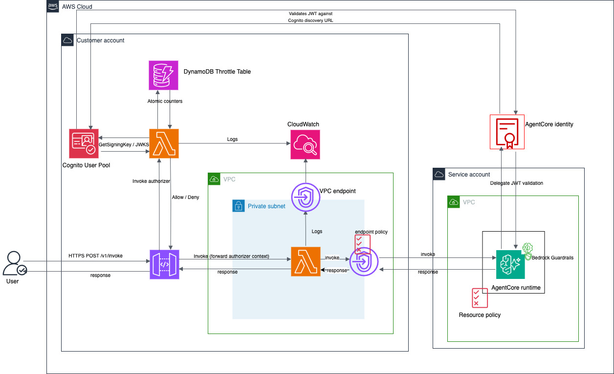
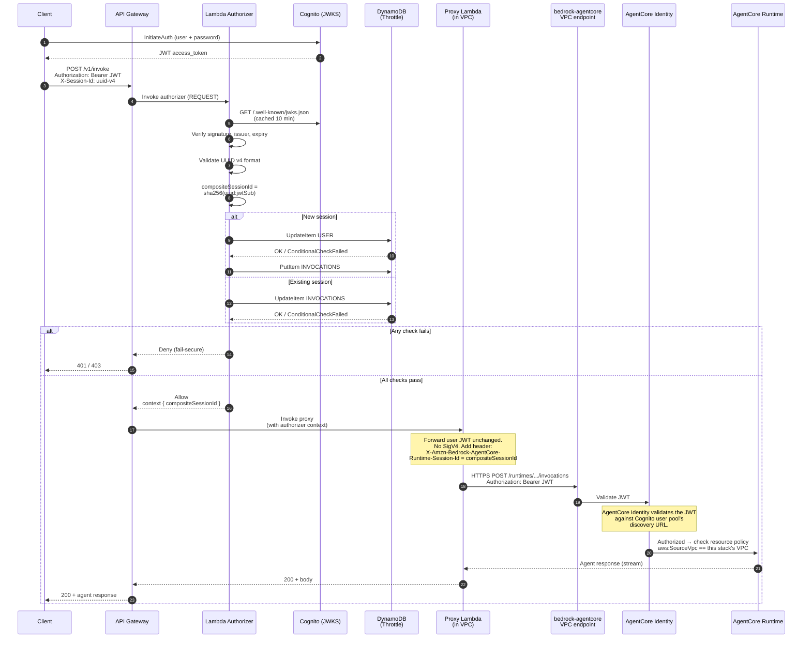

# Securely Exposing Amazon Bedrock AgentCore Runtime via API Gateway

**Disclaimer**: This is sample code, for non-production usage. You should work with your security and legal teams to meet your organizational security, regulatory and compliance requirements before deployment.

An example AWS CDK architecture for exposing [Amazon Bedrock AgentCore Runtime](https://docs.aws.amazon.com/bedrock-agentcore/latest/devguide/runtime.html) via a public [Amazon API Gateway](https://docs.aws.amazon.com/apigateway/latest/developerguide/welcome.html), deployed as a single AWS CDK stack. AgentCore Runtime is configured with **OAuth (Cognito) inbound auth**, so the user's JWT is validated by AgentCore Identity at the runtime in addition to a custom Lambda Authorizer at the edge. The sample demonstrates the customer-side defense-in-depth controls under the AWS shared responsibility model: edge JWT validation, session-ownership binding to the authenticated user, per-user / per-session throttling, an `aws:SourceVpc` perimeter on the runtime resource-based policy, and prompt-layer protection through Amazon Bedrock Guardrails.

## Architecture



## Request Flow



## Security Controls

> **Shared responsibility note.** AgentCore Runtime is secure by design — AWS handles JWT validation through AgentCore Identity, isolated execution, IAM authorization, encrypted service-to-service traffic, and service quotas. The controls below are the **customer-side controls** under the [AWS shared responsibility model](https://aws.amazon.com/compliance/shared-responsibility-model/) — application-layer policies that encode business semantics AWS cannot author for you.

### 1. Inbound JWT validation

All requests pass through a REST API Gateway with a REQUEST-type Lambda Authorizer that validates Cognito-issued JWTs (signature, issuer, expiry) and the UUID v4 format of the `X-Session-Id` header. AgentCore Runtime is configured with **OAuth (Cognito) inbound auth**, so the same JWT is then validated again at the runtime by AgentCore Identity against the Cognito user pool's [OIDC discovery URL](https://docs.aws.amazon.com/bedrock-agentcore/latest/devguide/inbound-jwt-authorizer.html). The user's token reaches the agent intact, which is the prerequisite for downstream on-behalf-of (OBO) and three-legged-OAuth flows.

### 2. Session ownership binding

AgentCore Runtime treats `runtimeSessionId` as opaque — by design, because only your application knows what session ownership means in your tenancy model. JWT validity confirms identity but says nothing about whether a session ID belongs to that identity. Without binding, an authenticated user A could submit user B's `X-Session-Id` and reach B's session — both calls have valid JWTs.

The Lambda Authorizer mitigates this by deriving the runtime session ID from a deterministic hash of the client UUID and the authenticated user's `sub` claim:

```
runtimeSessionId = sha256(<X-Session-Id> : <jwtSub>)
```

The hash is deterministic — the same user reusing the same UUID gets the same `runtimeSessionId`, so multi-turn conversations work without a server-side session-binding table. Two users using the same UUID get different hashes, so they cannot share session state. The Proxy Lambda forwards this composite as the `X-Amzn-Bedrock-AgentCore-Runtime-Session-Id` header on the outbound request.

### 3. Outbound network isolation

The Proxy Lambda runs in a VPC with private isolated subnets only — no Internet Gateway, no NAT Gateway. The only reachable services are those with configured VPC endpoints (DynamoDB, CloudWatch Logs, Lambda, `bedrock-agentcore`). No Lambda function in the VPC can reach the internet.

### 4. Runtime access perimeter

Two independent controls restrict the AgentCore Runtime to the intended path:

1. **VPC endpoint policy** — the `bedrock-agentcore` VPC endpoint has an explicit policy allowing `bedrock-agentcore:InvokeAgentRuntime` from any caller inside this VPC. With OAuth-inbound at the runtime, the Proxy Lambda forwards the user's JWT (no SigV4), so calls reach this VPCe with no IAM principal — an IAM-based filter on `aws:PrincipalArn` cannot work in this mode and would block legitimate traffic. Documenting the allow explicitly makes the architectural intent visible in IaC. _Who can actually reach the VPCe_ is enforced at the network layer by the security group (only the Proxy Lambda's SG can ingress on 443).
2. **Runtime resource-based policy** — applied to both the Runtime and its `DEFAULT` endpoint via a CDK `AwsCustomResource`. With OAuth inbound, the policy follows the [pattern documented for OAuth-authenticated runtimes](https://docs.aws.amazon.com/bedrock-agentcore/latest/devguide/resource-based-policies.html): `Effect: Allow`, `Principal: "*"`, gated by `aws:SourceVpc` matching this stack's VPC. The wildcard principal is required because OAuth tokens are validated by AgentCore Identity _before_ policy evaluation — only callers with valid JWTs from your registered IdP reach the policy. The `aws:SourceVpc` condition then narrows access to this stack's VPC.

Together these enforce: **valid JWT from your IdP AND request originating from this stack's VPC**. Either gate alone is bypassable; both together provide defense in depth. A JWT-authenticated call from outside the VPC (for example, the rewritten `scripts/test-agent-direct.ts` from a developer laptop) is rejected by the resource-based policy with `AccessDeniedException` — by design, because the laptop's request doesn't traverse your VPC endpoint and therefore doesn't carry `aws:SourceVpc` in its context.

### 5. Per-user / per-session throttling

The Lambda Authorizer enforces per-user session limits and per-session invocation limits using DynamoDB conditional writes. This addresses per-tenant fairness, per-user cost attribution, and compliance caps — granularity that AgentCore service quotas and API Gateway stage-level throttling do not provide:

- **Max sessions per user** (default: 5), prevents a single user from creating unlimited agent sessions
- **Max invocations per session** (default: 100), prevents unlimited calls within a session
- **Session TTL** (default: 24 hours), throttle records auto-expire via DynamoDB TTL

Limits are configurable via environment variables (`MAX_SESSIONS_PER_USER`, `MAX_INVOCATIONS_PER_SESSION`, `SESSION_TTL_HOURS`). The dedicated throttle table uses a single `pk` string partition key with synthetic prefixed keys (`USER#<sub>`, `INVOCATIONS#<compositeSessionId>`).

### 6. Prompt-layer protection

An [Amazon Bedrock Guardrail](https://aws.amazon.com/bedrock/guardrails/) is attached to the agent and applied on every model invocation. Configured for prompt-attack detection at HIGH input strength, PII anonymization for email and phone, and PII blocking for US Social Security numbers and credit card numbers. Tune the entity types, filter strengths, and blocked-output messaging to fit your domain.

### 7. Observability

Every authorization decision is logged as structured JSON to CloudWatch Logs (user ID, session ID, decision, reason). An `INVALID_JWT` metric filter feeds a CloudWatch alarm at the 5-in-5-minutes threshold to catch slow-burn brute-force or token-probing patterns.

## Project Structure

```
sample-expose-agentcore-via-api-gateway/
├── bin/app.ts                          # CDK app entry point
├── lib/agentcore-security-stack.ts     # Single CDK stack (all resources)
├── lambda/
│   ├── authorizer/index.ts             # JWT validation + composite hashing + throttling
│   ├── gateway/index.ts                # JWT-pass-through Proxy Lambda → AgentCore (in VPC)
│   └── shared/types.ts                 # Shared TypeScript interfaces
├── agent/
│   ├── handler.py                      # Strands Agent (Python, deployed to Runtime)
│   └── requirements.txt
├── scripts/
│   ├── deploy.sh                       # Full deployment (uv build + CDK)
│   ├── seed-data.ts                    # Seed Cognito test users
│   ├── test-agent-direct.ts            # JWT call to AgentCore from a laptop —
│   │                                   #   demonstrates the resource-based policy
│   │                                   #   rejects valid JWTs from outside the VPC
│   ├── test-security-controls.sh       # End-to-end security validation
│   └── cleanup.sh                      # Tear down stack
├── test/
│   └── architecture.test.ts            # CDK assertion tests
├── package.json
├── tsconfig.json
├── cdk.json
├── jest.config.js
├── README.md
├── LICENSE                             # MIT-0
├── CONTRIBUTING.md
└── CODE_OF_CONDUCT.md
```

## Prerequisites

- AWS Account with permissions to create VPC, Lambda, API Gateway, Cognito, DynamoDB, CloudWatch, and Bedrock AgentCore resources
- Node.js 20+
- AWS CDK CLI: `npm install -g aws-cdk`
- AWS credentials configured (via `aws configure`, environment variables, or SSO)

## Quick Start

### 1. Install dependencies

```bash
cd agentcore-runtime-security-sample
npm install
```

### 2. Deploy the stack

```bash
chmod +x scripts/deploy.sh
./scripts/deploy.sh
```

The deploy script will:

- Install dependencies
- Bootstrap CDK (if needed)
- Deploy the `AgentCoreSecurityStack`
- Print all stack outputs

### 3. Export stack outputs

After deployment, export the outputs printed by the deploy script:

```bash
export API_URL="<ApiUrl from output>"
export USER_POOL_ID="<UserPoolId from output>"
export USER_POOL_CLIENT_ID="<UserPoolClientId from output>"
export THROTTLE_TABLE_NAME="<ThrottleTableName from output>"
export AWS_REGION="<Region from output>"
export VPC_ID="<VpcId from output>"
```

### 4. Seed test data

Creates two Cognito test users and writes a pair of UUIDs for the test script to reuse.
No DynamoDB writes — the authorizer does not need a server-side session-binding table:

```bash
npx ts-node scripts/seed-data.ts
```

This creates:

The generated passwords and UUIDs are written to `scripts/seed-output.json` (gitignored)
for use by the test script and manual curl commands.

#### Alternative: create test users manually via the AWS Console

1. Open the **Amazon Cognito** console → **User pools** → select the pool created by the stack.
2. Click **Create user**.
3. Enter an email address (e.g. `user1@test.com`), check **Mark email as verified**, and set a temporary password.
4. After the user is created, select the user → **Actions** → **Set password** → enter a permanent password and check **Set as permanent**.
5. Repeat for a second user (e.g. `user2@test.com`).
6. For the test script and curl commands, create a `scripts/seed-output.json` file manually:

```json
{
  "user1Sub": "<sub from Cognito console>",
  "user2Sub": "<sub from Cognito console>",
  "user1SessionId": "<any UUID v4>",
  "user2SessionId": "<any UUID v4>",
  "user1Password": "<password you set>",
  "user2Password": "<password you set>"
}
```

You can generate UUIDs with: `python3 -c "import uuid; print(uuid.uuid4())"`

### 5. Run security tests

```bash
chmod +x scripts/test-security-controls.sh
./scripts/test-security-controls.sh
```

## Testing

### End-to-End Security Tests

The `scripts/test-security-controls.sh` script validates the security controls against the deployed stack:

| Test                   | What it does                               | Expected result                         |
| ---------------------- | ------------------------------------------ | --------------------------------------- |
| Outbound Security      | Checks VPC has no IGW and no NAT           | 0 gateways found                        |
| Runtime Direct Access  | Sends request without Authorization header | 401 (blocked at API Gateway)            |
| Invalid Session Format | Sends a non-UUID `X-Session-Id`            | 403 (authorizer denies)                 |
| Session Isolation      | Sends User2's JWT with User1's UUID        | 200 (allowed — composite hash isolates) |

Required environment variables:

```bash
API_URL, USER_POOL_ID, USER_POOL_CLIENT_ID, AWS_REGION, VPC_ID
```

### Unit Tests (CDK Assertions)

Run the CDK assertion tests locally (no deployment needed):

```bash
npm test
```

These tests verify:

- Proxy Lambda has no DynamoDB dependency (no `THROTTLE_TABLE_NAME` env var)
- Proxy Lambda source code has no session validation logic
- Authorizer source has no `SessionRecord` / binding lookup
- Lambda Authorizer exists with correct runtime and environment variables
- REQUEST-type authorizer is attached to the API
- VPC has no IGW, no NAT
- VPC endpoints exist (DynamoDB, CloudWatch, Lambda, Bedrock AgentCore)
- CloudWatch `INVALID_JWT` metric filter and alarm exist
- Cognito, DynamoDB throttle table, and all stack outputs are present

### Manual Testing with curl

Read the UUIDs generated by the seed script (any UUID v4 works; these are only for convenience):

```bash
SESSION_USER1=$(jq -r '.user1SessionId' scripts/seed-output.json)
SESSION_USER2=$(jq -r '.user2SessionId' scripts/seed-output.json)
```

Read the generated passwords (created by the seed script):

```bash
PASSWORD_USER1=$(jq -r '.user1Password' scripts/seed-output.json)
PASSWORD_USER2=$(jq -r '.user2Password' scripts/seed-output.json)
```

Authenticate and invoke the agent:

```bash
# Get a JWT
JWT=$(aws cognito-idp initiate-auth \
  --region $AWS_REGION \
  --client-id $USER_POOL_CLIENT_ID \
  --auth-flow USER_PASSWORD_AUTH \
  --auth-parameters "USERNAME=user1@test.com,PASSWORD=${PASSWORD_USER1}" \
  --query 'AuthenticationResult.AccessToken' \
  --output text)

# Invoke the agent (any valid UUID v4 works)
curl -X POST "${API_URL}invoke" \
  -H "Authorization: Bearer $JWT" \
  -H "X-Session-Id: $SESSION_USER1" \
  -H "Content-Type: application/json" \
  -d '{"prompt": "Hello, what can you do?"}'
```

Test session isolation (different users with the same UUID land on different AgentCore sessions):

```bash
# User1 with UUID X → AgentCore session sha256(X:user1-sub)
# User2 reusing UUID X → AgentCore session sha256(X:user2-sub)
# Both calls succeed, and they never share state.
curl -X POST "${API_URL}invoke" \
  -H "Authorization: Bearer $JWT_USER2" \
  -H "X-Session-Id: $SESSION_USER1" \
  -H "Content-Type: application/json" \
  -d '{"prompt": "Different user, different session"}'
```

## Resources Deployed

| Resource                                                        | Purpose                                                                            |
| --------------------------------------------------------------- | ---------------------------------------------------------------------------------- |
| VPC (private subnets only)                                      | Network isolation, no internet egress                                              |
| VPC Endpoints (DynamoDB, CloudWatch, Lambda, Bedrock AgentCore) | Private connectivity to AWS services                                               |
| Cognito User Pool + Client                                      | JWT-based authentication                                                           |
| DynamoDB Throttle Table                                         | Per-user session counters and per-session invocation counters (no session binding) |
| Lambda Authorizer                                               | JWT validation + composite session hashing + throttling                            |
| Proxy Lambda (in VPC)                                           | Thin pass-through to AgentCore Runtime                                             |
| REST API Gateway                                                | Single entry point with custom authorizer                                          |
| AgentCore Runtime + Strands Agent                               | AI agent hosted on Bedrock AgentCore                                               |
| CloudWatch Log Groups                                           | Structured audit logging                                                           |
| CloudWatch Metric Filter                                        | INVALID_JWT detection                                                              |
| CloudWatch Alarm                                                | Alert on high invalid-JWT rates                                                    |

## Cleanup

```bash
chmod +x scripts/cleanup.sh
./scripts/cleanup.sh
```

This runs `cdk destroy --force` to remove all provisioned resources.

## Customization

- **VPC CIDR**: Pass `vpcCidr` in stack props or CDK context (`-c vpcCidr=10.1.0.0/16`)
- **Agent code**: Replace `agent/handler.py` with your own Strands Agents agent
- **Throttle limits**: Adjust the `MAX_SESSIONS_PER_USER`, `MAX_INVOCATIONS_PER_SESSION`, and `SESSION_TTL_HOURS` environment variables on the authorizer Lambda
- **Monitoring**: Add SNS topics to the CloudWatch alarms for notifications
- **Authorizer caching**: Enable API Gateway authorizer result caching (TTL) for production workloads

## Key Design Decisions

- **OAuth (Cognito) inbound auth at the runtime**: AgentCore Runtime is configured with `RuntimeAuthorizerConfiguration.usingCognito(userPool, [userPoolClient])`. AgentCore Identity validates the user's JWT against the user pool's discovery URL on every invocation, so the user's identity reaches the agent. This is what enables OBO and three-legged-OAuth flows downstream — the agent acts on behalf of the authenticated user, not on behalf of the proxy Lambda's IAM role.

- **Proxy Lambda as VPC-resident origin**: API Gateway HTTP_PROXY directly to AgentCore is technically possible (the runtime data plane is just an HTTPS API), but it cannot satisfy `aws:SourceVpc` — API Gateway integration calls leave from the API Gateway service network, not from your VPC. To enforce the VPC perimeter via the Runtime resource-based policy, the actual `InvokeAgentRuntime` call must originate from compute that lives in your VPC. The Proxy Lambda is the cheapest such compute. It does **not** sign the call (the runtime is OAuth-inbound, not IAM-inbound) — it forwards the user's `Authorization: Bearer <JWT>` unchanged via raw HTTPS, and adds the `X-Amzn-Bedrock-AgentCore-Runtime-Session-Id` header from the authorizer context.

- **Lambda Authorizer runs outside the VPC**: The Authorizer needs to reach Cognito's JWKS endpoint to validate JWT signatures. Running it outside the VPC avoids the need for a Cognito VPC endpoint. DynamoDB access works via the public service endpoint.

- **Proxy Lambda runs inside the VPC**: Private subnets with no internet egress, so its only path to AgentCore is via the `bedrock-agentcore` VPC endpoint. The VPCe security group restricts inbound to the Proxy Lambda's SG on 443 (network-layer restriction), and the Runtime resource-based policy independently enforces `aws:SourceVpc` on the runtime side. The VPCe policy itself is an explicit allow for `InvokeAgentRuntime` — required because OAuth-inbound calls have no IAM principal to filter on.

## Recommendations

The controls shipped in this stack — Lambda Authorizer (JWT + UUID + composite hashing + throttling), VPC + private subnets + VPC endpoints, VPC endpoint policy, Runtime resource-based policy with `aws:SourceVpc`, and Bedrock Guardrails — give you a defense-in-depth posture out of the box. One additional layer is worth adding before going to production.

### AWS WAF in front of API Gateway

Associate an AWS WAF Web ACL with the REST API stage to inspect requests _before_ they reach the Lambda Authorizer. Recommended rule set:

- **AWSManagedRulesCommonRuleSet** — generic OWASP protections (XSS, LFI, RFI, bad bots).
- **AWSManagedRulesSQLiRuleSet** — SQL injection signatures on the body, query string, and headers. The agent prompt body is untrusted free-form text, so this is the rule set that directly addresses the "user prompt carrying injection payloads" threat model.
- **AWSManagedRulesKnownBadInputsRuleSet** — blocks known exploit patterns in headers/body.
- **Rate-based rule** — a per-source-IP limit (e.g. 2,000 req / 5 min) as a first-line brake before the DynamoDB throttle counters.
- **Custom rules** — size constraints on the request body and a string-match block list on `X-Session-Id` values that fail UUID v4 shape (cheaper than reaching the authorizer).

CDK sketch:

```typescript
const webAcl = new wafv2.CfnWebACL(this, "ApiWebAcl", {
  scope: "REGIONAL",
  defaultAction: { allow: {} },
  visibilityConfig: {
    cloudWatchMetricsEnabled: true,
    metricName: "ApiWebAcl",
    sampledRequestsEnabled: true,
  },
  rules: [
    {
      name: "AWS-Common",
      priority: 0,
      overrideAction: { none: {} },
      statement: {
        managedRuleGroupStatement: {
          vendorName: "AWS",
          name: "AWSManagedRulesCommonRuleSet",
        },
      },
      visibilityConfig: {
        cloudWatchMetricsEnabled: true,
        metricName: "AWS-Common",
        sampledRequestsEnabled: true,
      },
    },
    {
      name: "AWS-SQLi",
      priority: 1,
      overrideAction: { none: {} },
      statement: {
        managedRuleGroupStatement: {
          vendorName: "AWS",
          name: "AWSManagedRulesSQLiRuleSet",
        },
      },
      visibilityConfig: {
        cloudWatchMetricsEnabled: true,
        metricName: "AWS-SQLi",
        sampledRequestsEnabled: true,
      },
    },
    {
      name: "AWS-KnownBadInputs",
      priority: 2,
      overrideAction: { none: {} },
      statement: {
        managedRuleGroupStatement: {
          vendorName: "AWS",
          name: "AWSManagedRulesKnownBadInputsRuleSet",
        },
      },
      visibilityConfig: {
        cloudWatchMetricsEnabled: true,
        metricName: "AWS-KnownBadInputs",
        sampledRequestsEnabled: true,
      },
    },
  ],
});

new wafv2.CfnWebACLAssociation(this, "ApiWebAclAssoc", {
  resourceArn: `arn:aws:apigateway:${this.region}::/restapis/${api.restApiId}/stages/${api.deploymentStage.stageName}`,
  webAclArn: webAcl.attrArn,
});
```

## Resource-based policy on the AgentCore Runtime (shipped in this stack)

The OAuth + VPC perimeter is enforced via a resource-based policy attached to the AgentCore Runtime — this is one of the shipped controls, not a future recommendation. Why it matters: in OAuth-inbound mode the Proxy Lambda forwards JWTs without SigV4, so the VPC endpoint policy can't restrict by IAM principal — only by intent (allow-all for `InvokeAgentRuntime`). Network-level restriction is handled by the VPCe's security group (only the Proxy Lambda's SG can reach the VPCe). The Runtime resource-based policy is what actually enforces the perimeter on the runtime side: it independently rejects any request that didn't arrive through this stack's VPC, regardless of the network path the caller chose.

This stack **applies the policy automatically** via a CDK `AwsCustomResource` (the alpha `Runtime` construct does not yet expose a resource-policy property). At deploy time, the custom resource calls `bedrock-agentcore-control:PutResourcePolicy` against both the Runtime ARN and its `DEFAULT` endpoint ARN; on stack deletion it calls `DeleteResourcePolicy`. See `lib/agentcore-security-stack.ts` (search for `RuntimeResourcePolicy`).

The OAuth-inbound pattern from the AgentCore documentation requires a wildcard principal because OAuth tokens are validated by AWS Identity Service _before_ policy evaluation — only callers with valid JWTs from the registered IdP reach policy evaluation:

```json
{
  "Version": "2012-10-17",
  "Statement": [
    {
      "Sid": "AllowOAuthFromVpc",
      "Effect": "Allow",
      "Principal": "*",
      "Action": "bedrock-agentcore:InvokeAgentRuntime",
      "Resource": "arn:aws:bedrock-agentcore:<region>:<account-id>:runtime/<AGENT_RUNTIME_ID>",
      "Condition": {
        "StringEquals": { "aws:SourceVpc": "<this-stack-vpc-id>" }
      }
    }
  ]
}
```

Notes:

- `Principal: "*"` is **required** for OAuth-inbound runtimes per the [AgentCore docs](https://docs.aws.amazon.com/bedrock-agentcore/latest/devguide/resource-based-policies.html). It does not mean "anyone" — AgentCore Identity rejects callers without a valid JWT before this policy is evaluated.
- The `aws:SourceVpc` condition is the actual perimeter. The condition is satisfied only when the request enters AWS through an interface VPC endpoint in your VPC — i.e., when the caller is compute that lives in your VPC. Calls from outside (a developer laptop, another AWS account, API Gateway HTTP_PROXY) don't carry `aws:SourceVpc` in their request context, so the condition fails and the policy denies.
- AgentCore Runtime authorization is evaluated at both the runtime and the endpoint, so the same policy is attached to the runtime **and** to its `DEFAULT` endpoint (`arn:…:runtime/<ID>/runtime-endpoint/DEFAULT`). Without both, the request is denied.
- The `Resource` field must match the ARN of the resource the policy is attached to — wildcards are rejected by the service.
- The resource-based policy supports the [full range of IAM condition keys](https://docs.aws.amazon.com/bedrock-agentcore/latest/devguide/resource-based-policies.html), not just `aws:SourceVpc`. Examples: `aws:PrincipalOrgID` to restrict to your AWS Organization, `aws:SourceArn` for cross-account scoping, `aws:CalledVia` for service-to-service patterns. Tailor the condition set to your security model.

> **Demonstrating the perimeter — `scripts/test-agent-direct.ts`.** This script authenticates against Cognito to obtain a valid JWT, then calls AgentCore Runtime directly over the public internet from your laptop. Because the call doesn't traverse the VPC endpoint, `aws:SourceVpc` isn't populated and the resource-based policy returns `AccessDeniedException` — even though the JWT is valid. **This is expected behavior** and demonstrates that the perimeter is doing its job: the only valid path to the Runtime is **API Gateway → Lambda Authorizer → Proxy Lambda (in VPC) → Bedrock AgentCore VPC endpoint → AgentCore Runtime.**

With WAF added in front, the full defense-in-depth chain becomes: **WAF → API Gateway → Lambda Authorizer (JWT + UUID + composite hash + throttling) → Proxy Lambda (forwards JWT, no SigV4) → VPC endpoint policy → AgentCore Identity (JWT validation) → Runtime resource policy (`aws:SourceVpc`) → AgentCore Runtime**.

## Contributors

Meriem Smache, Christian Kamwangala, Lior Perez, Charline Boulie

## License

This library is licensed under the MIT-0 License. See the [LICENSE](LICENSE) file.
