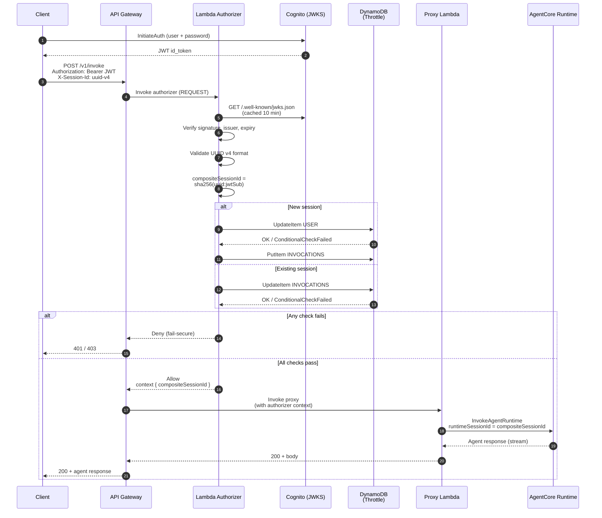

# Securing Amazon Bedrock AgentCore Runtime — CDK Reference Architecture

**Disclaimer**: This is sample code, for non-production usage. You should work with your security and legal teams to meet your organizational security, regulatory and compliance requirements before deployment.

A defense-in-depth example architecture for exposing [Amazon Bedrock AgentCore Runtime](https://docs.aws.amazon.com/bedrock/latest/userguide/agentcore.html) via [Amazon API Gateway](https://docs.aws.amazon.com/apigateway/latest/developerguide/welcome.html), deployed as a single AWS CDK stack. This sample demonstrates five security best practices for production agent deployments.

## Architecture


## Request Flow



## Security Controls

### 1. Inbound Security
All requests pass through a REST API Gateway with a REQUEST-type Lambda Authorizer. The authorizer validates Cognito-issued JWTs (signature, expiry, issuer) and the UUID v4 format of the `X-Session-Id` header before allowing any request through. No request reaches the agent without passing all checks.

### 2. Outbound Security
The Proxy Lambda runs in a VPC with private subnets only, no Internet Gateway and no NAT Gateway. The only reachable services are those with configured VPC endpoints (DynamoDB, CloudWatch, Bedrock AgentCore, Lambda). No Lambda function in the VPC can reach the internet.

### 3. Runtime Direct Access Prevention
Two independent gates prevent anyone from bypassing API Gateway to reach the Runtime directly:

1. **VPC endpoint policy** — the Bedrock AgentCore VPC endpoint has an IAM policy that allows only the Proxy Lambda's execution role to invoke the Runtime. An explicit Deny statement blocks all other principals. This controls *who can use the endpoint*.
2. **Runtime resource-based policy** — applied to both the Runtime and its `DEFAULT` endpoint via a CDK `AwsCustomResource`. It denies any invocation whose `aws:SourceVpce` does not match this stack's endpoint. This controls *what the Runtime itself accepts*, independent of the network path. Even if another principal in the account gained `bedrock-agentcore:InvokeAgentRuntime` and a different network path, the Runtime would still reject the call.

Together these give two layers: compromise of one does not expose the Runtime. Direct invocations from outside the VPC (for example, `scripts/test-agent-direct.ts` from a developer laptop) are rejected with `AccessDeniedException` — the only valid path is **API Gateway → Authorizer → Proxy Lambda → VPC endpoint → Runtime**.


### 5. Rate Limiting & Throttling
The Lambda Authorizer enforces per-user session limits and per-session invocation limits using DynamoDB atomic counters. This prevents resource exhaustion and cost abuse:

- **Max sessions per user** (default: 5), prevents a single user from creating unlimited agent sessions
- **Max invocations per session** (default: 100), prevents unlimited calls within a session
- **Session TTL** (default: 24 hours), throttle records auto-expire via DynamoDB TTL

Limits are configurable via environment variables (`MAX_SESSIONS_PER_USER`, `MAX_INVOCATIONS_PER_SESSION`, `SESSION_TTL_HOURS`). The dedicated throttle table uses a single `pk` string partition key with synthetic prefixed keys (`USER#<sub>`, `INVOCATIONS#<compositeSessionId>`).

## Project Structure

```
agentcore-runtime-security-sample/
├── bin/app.ts                          # CDK app entry point
├── lib/agentcore-security-stack.ts     # Single CDK stack (all resources)
├── lambda/
│   ├── authorizer/index.ts             # JWT validation + composite hashing + throttling
│   ├── gateway/index.ts                # Thin proxy → AgentCore Runtime
│   └── shared/types.ts                 # Shared TypeScript interfaces
├── agent/
│   ├── handler.py                      # Strands Agent (Python, deployed to Runtime)
│   └── requirements.txt
├── scripts/
│   ├── deploy.sh                       # Full deployment (uv build + CDK)
│   ├── seed-data.ts                    # Seed Cognito test users
│   ├── test-agent-direct.ts            # Direct AgentCore Runtime invocation test
│   ├── test-security-controls.sh       # End-to-end security validation
│   └── cleanup.sh                      # Tear down stack
├── test/
│   └── remove-gateway-lambda.test.ts   # CDK assertion tests
├── package.json
├── tsconfig.json
├── cdk.json
├── jest.config.js
├── README.md
├── LICENSE                             # MIT-0
├── CONTRIBUTING.md
└── CODE_OF_CONDUCT.md
```

## Prerequisites

- AWS Account with permissions to create VPC, Lambda, API Gateway, Cognito, DynamoDB, CloudWatch, and Bedrock AgentCore resources
- Node.js 20+
- AWS CDK CLI: `npm install -g aws-cdk`
- AWS credentials configured (via `aws configure`, environment variables, or SSO)

## Quick Start

### 1. Install dependencies

```bash
cd agentcore-runtime-security-sample
npm install
```

### 2. Deploy the stack

```bash
chmod +x scripts/deploy.sh
./scripts/deploy.sh
```

The deploy script will:
- Install dependencies
- Bootstrap CDK (if needed)
- Deploy the `AgentCoreSecurityStack`
- Print all stack outputs

### 3. Export stack outputs

After deployment, export the outputs printed by the deploy script:

```bash
export API_URL="<ApiUrl from output>"
export USER_POOL_ID="<UserPoolId from output>"
export USER_POOL_CLIENT_ID="<UserPoolClientId from output>"
export THROTTLE_TABLE_NAME="<ThrottleTableName from output>"
export AWS_REGION="<Region from output>"
export VPC_ID="<VpcId from output>"
```

### 4. Seed test data

Creates two Cognito test users and writes a pair of UUIDs for the test script to reuse.
No DynamoDB writes — the authorizer does not need a server-side session-binding table:

```bash
npx ts-node scripts/seed-data.ts
```

This creates:

The generated passwords and UUIDs are written to `scripts/seed-output.json` (gitignored)
for use by the test script and manual curl commands.

#### Alternative: create test users manually via the AWS Console

1. Open the **Amazon Cognito** console → **User pools** → select the pool created by the stack.
2. Click **Create user**.
3. Enter an email address (e.g. `user1@test.com`), check **Mark email as verified**, and set a temporary password.
4. After the user is created, select the user → **Actions** → **Set password** → enter a permanent password and check **Set as permanent**.
5. Repeat for a second user (e.g. `user2@test.com`).
6. For the test script and curl commands, create a `scripts/seed-output.json` file manually:

```json
{
  "user1Sub": "<sub from Cognito console>",
  "user2Sub": "<sub from Cognito console>",
  "user1SessionId": "<any UUID v4>",
  "user2SessionId": "<any UUID v4>",
  "user1Password": "<password you set>",
  "user2Password": "<password you set>"
}
```

You can generate UUIDs with: `python3 -c "import uuid; print(uuid.uuid4())"`

### 5. Run security tests

```bash
chmod +x scripts/test-security-controls.sh
./scripts/test-security-controls.sh
```

## Testing

### End-to-End Security Tests

The `scripts/test-security-controls.sh` script validates the security controls against the deployed stack:

| Test | What it does | Expected result |
|------|-------------|-----------------|
| Outbound Security | Checks VPC has no IGW and no NAT | 0 gateways found |
| Runtime Direct Access | Sends request without Authorization header | 401 (blocked at API Gateway) |
| Invalid Session Format | Sends a non-UUID `X-Session-Id` | 403 (authorizer denies) |
| Session Isolation | Sends User2's JWT with User1's UUID | 200 (allowed — composite hash isolates) |

Required environment variables:
```bash
API_URL, USER_POOL_ID, USER_POOL_CLIENT_ID, AWS_REGION, VPC_ID
```

### Unit Tests (CDK Assertions)

Run the CDK assertion tests locally (no deployment needed):

```bash
npm test
```

These tests verify:
- Proxy Lambda has no DynamoDB dependency (no `THROTTLE_TABLE_NAME` env var)
- Proxy Lambda source code has no session validation logic
- Authorizer source has no `SessionRecord` / binding lookup
- Lambda Authorizer exists with correct runtime and environment variables
- REQUEST-type authorizer is attached to the API
- VPC has no IGW, no NAT
- VPC endpoints exist (DynamoDB, CloudWatch, Lambda, Bedrock AgentCore)
- CloudWatch `INVALID_JWT` metric filter and alarm exist
- Cognito, DynamoDB throttle table, and all stack outputs are present

### Manual Testing with curl

Read the UUIDs generated by the seed script (any UUID v4 works; these are only for convenience):

```bash
SESSION_USER1=$(jq -r '.user1SessionId' scripts/seed-output.json)
SESSION_USER2=$(jq -r '.user2SessionId' scripts/seed-output.json)
```

Read the generated passwords (created by the seed script):

```bash
PASSWORD_USER1=$(jq -r '.user1Password' scripts/seed-output.json)
PASSWORD_USER2=$(jq -r '.user2Password' scripts/seed-output.json)
```

Authenticate and invoke the agent:

```bash
# Get a JWT
JWT=$(aws cognito-idp initiate-auth \
  --region $AWS_REGION \
  --client-id $USER_POOL_CLIENT_ID \
  --auth-flow USER_PASSWORD_AUTH \
  --auth-parameters "USERNAME=user1@test.com,PASSWORD=${PASSWORD_USER1}" \
  --query 'AuthenticationResult.IdToken' \
  --output text)

# Invoke the agent (any valid UUID v4 works)
curl -X POST "${API_URL}invoke" \
  -H "Authorization: Bearer $JWT" \
  -H "X-Session-Id: $SESSION_USER1" \
  -H "Content-Type: application/json" \
  -d '{"prompt": "Hello, what can you do?"}'
```

Test session isolation (different users with the same UUID land on different AgentCore sessions):

```bash
# User1 with UUID X → AgentCore session sha256(X:user1-sub)
# User2 reusing UUID X → AgentCore session sha256(X:user2-sub)
# Both calls succeed, and they never share state.
curl -X POST "${API_URL}invoke" \
  -H "Authorization: Bearer $JWT_USER2" \
  -H "X-Session-Id: $SESSION_USER1" \
  -H "Content-Type: application/json" \
  -d '{"prompt": "Different user, different session"}'
```

## Resources Deployed

| Resource | Purpose |
|----------|---------|
| VPC (private subnets only) | Network isolation, no internet egress |
| VPC Endpoints (DynamoDB, CloudWatch, Lambda, Bedrock AgentCore) | Private connectivity to AWS services |
| Cognito User Pool + Client | JWT-based authentication |
| DynamoDB Throttle Table | Per-user session counters and per-session invocation counters (no session binding) |
| Lambda Authorizer | JWT validation + composite session hashing + throttling |
| Proxy Lambda (in VPC) | Thin pass-through to AgentCore Runtime |
| REST API Gateway | Single entry point with custom authorizer |
| AgentCore Runtime + Strands Agent | AI agent hosted on Bedrock AgentCore |
| CloudWatch Log Groups | Structured audit logging |
| CloudWatch Metric Filter | INVALID_JWT detection |
| CloudWatch Alarm | Alert on high invalid-JWT rates |

## Cleanup

```bash
chmod +x scripts/cleanup.sh
./scripts/cleanup.sh
```

This runs `cdk destroy --force` to remove all provisioned resources.

## Customization

- **VPC CIDR**: Pass `vpcCidr` in stack props or CDK context (`-c vpcCidr=10.1.0.0/16`)
- **Agent code**: Replace `agent/handler.py` with your own Strands Agents agent
- **Throttle limits**: Adjust the `MAX_SESSIONS_PER_USER`, `MAX_INVOCATIONS_PER_SESSION`, and `SESSION_TTL_HOURS` environment variables on the authorizer Lambda
- **Monitoring**: Add SNS topics to the CloudWatch alarms for notifications
- **Authorizer caching**: Enable API Gateway authorizer result caching (TTL) for production workloads

## Key Design Decisions

- **Proxy Lambda instead of direct API Gateway → AgentCore integration**: API Gateway REST API doesn't support direct AWS service integration with Bedrock Agent Runtime (not in the supported services list, and AgentCore uses streaming responses). The Proxy Lambda is a thin pass-through that only invokes AgentCore Runtime, no session validation, no DynamoDB dependency. All security checks are handled by the Lambda Authorizer.

- **Lambda Authorizer runs outside VPC**: The Authorizer needs to reach Cognito's JWKS endpoint to validate JWT signatures. Running it outside the VPC avoids the need for a Cognito VPC endpoint. DynamoDB access works via the public endpoint.

- **Proxy Lambda runs inside VPC**: The Proxy Lambda runs in private subnets with no internet egress, ensuring it can only reach AgentCore Runtime through the VPC endpoint. The VPC endpoint policy restricts access to only the Proxy Lambda's execution role.

## Recommendations

The controls shipped in this stack stop a JWT-authenticated user from reaching AgentCore on a path they are not entitled to, and they prevent any other principal in the account from invoking the Runtime via the VPC endpoint. Two additional layers are worth adding for a production deployment.

### 1. AWS WAF in front of API Gateway

Associate an AWS WAF Web ACL with the REST API stage to inspect requests *before* they reach the Lambda Authorizer. Recommended rule set:

- **AWSManagedRulesCommonRuleSet** — generic OWASP protections (XSS, LFI, RFI, bad bots).
- **AWSManagedRulesSQLiRuleSet** — SQL injection signatures on the body, query string, and headers. The agent prompt body is untrusted free-form text, so this is the rule set that directly addresses the "user prompt carrying injection payloads" threat model.
- **AWSManagedRulesKnownBadInputsRuleSet** — blocks known exploit patterns in headers/body.
- **Rate-based rule** — a per-source-IP limit (e.g. 2,000 req / 5 min) as a first-line brake before the DynamoDB throttle counters.
- **Custom rules** — size constraints on the request body and a string-match block list on `X-Session-Id` values that fail UUID v4 shape (cheaper than reaching the authorizer).

CDK sketch:

```typescript
const webAcl = new wafv2.CfnWebACL(this, 'ApiWebAcl', {
  scope: 'REGIONAL',
  defaultAction: { allow: {} },
  visibilityConfig: { cloudWatchMetricsEnabled: true, metricName: 'ApiWebAcl', sampledRequestsEnabled: true },
  rules: [
    { name: 'AWS-Common',        priority: 0, overrideAction: { none: {} }, statement: { managedRuleGroupStatement: { vendorName: 'AWS', name: 'AWSManagedRulesCommonRuleSet' } },        visibilityConfig: { cloudWatchMetricsEnabled: true, metricName: 'AWS-Common',        sampledRequestsEnabled: true } },
    { name: 'AWS-SQLi',          priority: 1, overrideAction: { none: {} }, statement: { managedRuleGroupStatement: { vendorName: 'AWS', name: 'AWSManagedRulesSQLiRuleSet' } },           visibilityConfig: { cloudWatchMetricsEnabled: true, metricName: 'AWS-SQLi',          sampledRequestsEnabled: true } },
    { name: 'AWS-KnownBadInputs', priority: 2, overrideAction: { none: {} }, statement: { managedRuleGroupStatement: { vendorName: 'AWS', name: 'AWSManagedRulesKnownBadInputsRuleSet' } }, visibilityConfig: { cloudWatchMetricsEnabled: true, metricName: 'AWS-KnownBadInputs', sampledRequestsEnabled: true } },
  ],
});

new wafv2.CfnWebACLAssociation(this, 'ApiWebAclAssoc', {
  resourceArn: `arn:aws:apigateway:${this.region}::/restapis/${api.restApiId}/stages/${api.deploymentStage.stageName}`,
  webAclArn: webAcl.attrArn,
});
```

### 2. Resource-based policy on the AgentCore Runtime

Without a resource-based policy, the only boundary around AgentCore Runtime is the VPC endpoint policy — if another principal in the account somehow gained `bedrock-agentcore:InvokeAgentRuntime` and a different network path, they could reach the Runtime. Attaching a resource-based policy directly to the Runtime closes that hole: the Runtime itself rejects any request that did not arrive through this VPC endpoint.

This stack **applies the policy automatically** via a CDK `AwsCustomResource` (the alpha `Runtime` construct does not yet expose a resource-policy property). At deploy time, the custom resource calls `bedrock-agentcore-control:PutResourcePolicy` against both the Runtime ARN and its `DEFAULT` endpoint ARN; on stack deletion it calls `DeleteResourcePolicy`. See `lib/agentcore-security-stack.ts` (search for `RuntimeResourcePolicy`).

Policy (deny-only guardrail — same-account callers are already granted via identity policy, so we only need to reject traffic that did not come through the VPC endpoint):

```json
{
  "Version": "2012-10-17",
  "Statement": [
    {
      "Sid": "DenyUnlessViaVpce",
      "Effect": "Deny",
      "Principal": "*",
      "Action": "bedrock-agentcore:*",
      "Resource": "arn:aws:bedrock-agentcore:<region>:<account-id>:runtime/<AGENT_RUNTIME_ID>",
      "Condition": {
        "StringNotEquals": { "aws:SourceVpce": "<bedrock-agentcore-vpce-id>" },
        "Bool":           { "aws:ViaAWSService": "false" }
      }
    }
  ]
}
```

Notes:
- No explicit Allow is needed for same-account principals — the Proxy Lambda role's identity policy already grants `bedrock-agentcore:InvokeAgentRuntime`. Resource-policy Allows are only required for cross-account access. The Deny above is pure perimeter enforcement: "reject anything not coming through this VPCE, regardless of caller identity."
- Because AgentCore Runtime authorization is evaluated at both the runtime and the endpoint, the same policy is attached to the runtime **and** to its `DEFAULT` endpoint (`arn:…:runtime/<ID>/runtime-endpoint/DEFAULT`). Without both, the request is denied.
- The `Resource` field must match the ARN of the resource the policy is attached to — wildcards are rejected by the service.
- `aws:SourceVpce` is the condition key that constrains invocations to traffic arriving through the specific interface endpoint created by this stack. Combined with the existing endpoint *policy* (which gates who can use the endpoint), this gives two independent gates: "who can reach the endpoint" and "what the Runtime accepts."
- `aws:ViaAWSService: false` preserves the normal escape hatch for AWS-internal service-to-service calls.

> **Note — `scripts/test-agent-direct.ts` will fail once this policy is in place.** That script invokes AgentCore Runtime directly from your local AWS credentials over the public internet. With the resource policy attached, the call does not come through the VPC endpoint, so the Runtime rejects it with `AccessDeniedException`. **This is expected behavior** — it's exactly the property the policy is meant to provide. The only valid path to the Runtime is now: **API Gateway → Lambda Authorizer → Proxy Lambda (in VPC) → Bedrock AgentCore VPC endpoint → AgentCore Runtime.**

With both layers added, the full defense-in-depth chain becomes: **WAF → API Gateway → Lambda Authorizer (JWT + composite hash + throttling) → Proxy Lambda → VPC endpoint policy → Runtime resource policy (source-VPCE) → AgentCore Runtime**.

## Contributors

Meriem Smache, Christian Kamwangala, Lior Perez, Charline Boulie

## License

This library is licensed under the MIT-0 License. See the [LICENSE](LICENSE) file.
