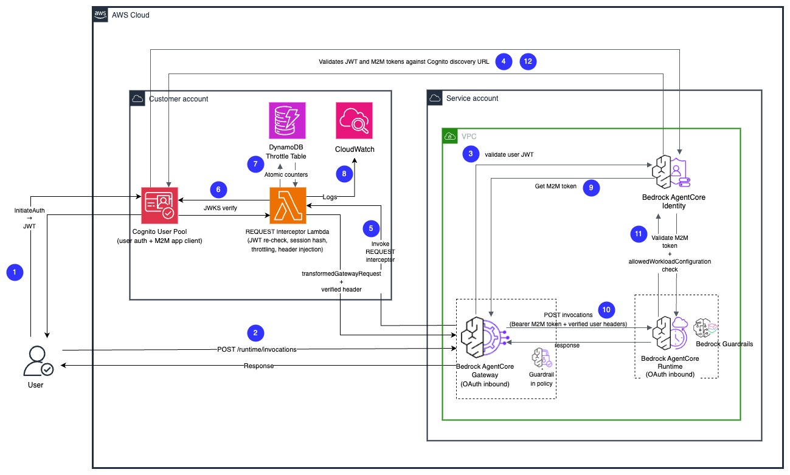
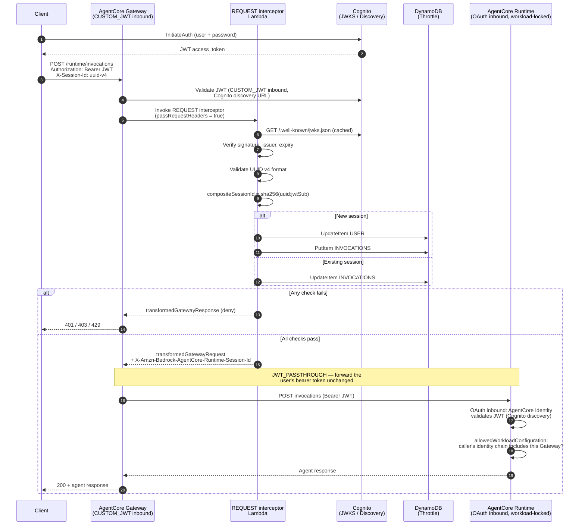

# Securely Exposing Amazon Bedrock AgentCore Runtime via AgentCore Gateway

**Disclaimer**: This is sample code, for non-production usage. You should work with your security and legal teams to meet your organizational security, regulatory and compliance requirements before deployment.

An example AWS CDK architecture for exposing [Amazon Bedrock AgentCore Runtime](https://docs.aws.amazon.com/bedrock-agentcore/latest/devguide/runtime.html) through an [Amazon Bedrock AgentCore Gateway](https://docs.aws.amazon.com/bedrock-agentcore/latest/devguide/gateway.html), deployed as a single AWS CDK stack. The Gateway is the single, governed entry point to the runtime: it validates the user's Cognito JWT (CUSTOM_JWT inbound), runs a [REQUEST interceptor](https://docs.aws.amazon.com/bedrock-agentcore/latest/devguide/gateway-interceptors.html) Lambda that carries the customer-side authorization logic, and forwards the request to the runtime with the user's token passed through unchanged. The runtime is OAuth-inbound and is **locked to this Gateway** via `allowedWorkloadConfiguration`, so a valid JWT sent from anywhere other than the Gateway is rejected.

This is a migration of the older "API Gateway + Lambda Authorizer + VPC-resident proxy Lambda" design. The Gateway absorbs three roles that were previously separate — the public entry point, inbound JWT validation, and the outbound call to the runtime — and the interceptor takes over the custom authorization logic (composite session hashing, throttling, audit logging). The VPC, VPC endpoints, and proxy Lambda are no longer needed: the "no bypass" perimeter is enforced natively by the runtime's workload lock rather than by an `aws:SourceVpc` resource policy.

## Architecture



> The diagram above still shows the previous (API Gateway) topology; the request flow below is authoritative for this version.

## Request Flow


```mermaid
sequenceDiagram
    autonumber
    participant C as Client
    participant G as AgentCore Gateway<br/>(CUSTOM_JWT inbound)
    participant I as REQUEST interceptor<br/>Lambda
    participant K as Cognito<br/>(JWKS / Discovery)
    participant D as DynamoDB<br/>(Throttle)
    participant R as AgentCore Runtime<br/>(OAuth inbound, workload-locked)

    C->>K: InitiateAuth (user + password)
    K-->>C: JWT access_token
    C->>G: POST /runtime/invocations<br/>Authorization: Bearer JWT<br/>X-Session-Id: uuid-v4

    G->>K: Validate JWT (CUSTOM_JWT inbound,<br/>Cognito discovery URL)
    G->>I: Invoke REQUEST interceptor<br/>(passRequestHeaders = true)

    I->>K: GET /.well-known/jwks.json (cached)
    I->>I: Verify signature, issuer, expiry
    I->>I: Validate UUID v4 format
    I->>I: compositeSessionId = sha256(uuid:jwtSub)

    alt New session
        I->>D: UpdateItem USER#sub<br/>condition: sessionCount < MAX
        I->>D: PutItem INVOCATIONS#hash counter=1
    else Existing session
        I->>D: UpdateItem INVOCATIONS#hash<br/>condition: invocationCount < MAX
    end

    alt Any check fails
        I-->>G: transformedGatewayResponse (deny)
        G-->>C: 401 / 403 / 429
    else All checks pass
        I-->>G: transformedGatewayRequest<br/>+ X-Amzn-Bedrock-AgentCore-Runtime-Session-Id
        Note over G,R: JWT_PASSTHROUGH — forward the<br/>user's bearer token unchanged
        G->>R: POST invocations (Bearer JWT)
        R->>R: OAuth inbound: AgentCore Identity<br/>validates JWT (Cognito discovery)
        R->>R: allowedWorkloadConfiguration:<br/>caller's identity chain includes this Gateway?
        R-->>G: Agent response
        G-->>C: 200 + agent response
    end
```

## Security Controls

> **Shared responsibility note.** AgentCore Runtime and Gateway are secure by design — AWS handles JWT validation through AgentCore Identity, isolated execution, IAM authorization, encrypted service-to-service traffic, and service quotas. The controls below are the **customer-side controls** under the [AWS shared responsibility model](https://aws.amazon.com/compliance/shared-responsibility-model/) — application-layer policies that encode business semantics AWS cannot author for you.

### 1. Inbound JWT validation (three layers)

The Gateway is configured with a **`CUSTOM_JWT` inbound authorizer** pointed at the Cognito user pool's [OIDC discovery URL](https://docs.aws.amazon.com/bedrock-agentcore/latest/devguide/gateway-using-auth.html), so it validates the user's JWT before doing anything else. The REQUEST interceptor **re-validates** the JWT (signature, issuer, expiry) — both as defense in depth and so it can read the `sub` claim and emit `INVALID_JWT` telemetry. Finally, the runtime is **OAuth-inbound**, so AgentCore Identity validates the same JWT a third time. The user's token reaches the agent intact, which is the prerequisite for downstream on-behalf-of (OBO) and three-legged-OAuth flows.

### 2. Session ownership binding

AgentCore Runtime treats the runtime session ID as opaque — by design, because only your application knows what session ownership means in your tenancy model. JWT validity confirms identity but says nothing about whether a session ID belongs to that identity. Without binding, an authenticated user A could submit user B's `X-Session-Id` and reach B's session — both calls have valid JWTs.

The REQUEST interceptor mitigates this by deriving the runtime session ID from a deterministic hash of the client UUID and the authenticated user's `sub` claim:

```
runtimeSessionId = sha256(<X-Session-Id> : <jwtSub>)
```

The hash is deterministic — the same user reusing the same UUID gets the same `runtimeSessionId`, so multi-turn conversations work without a server-side session-binding table. Two users using the same UUID get different hashes, so they cannot share session state. The interceptor injects this composite as the `X-Amzn-Bedrock-AgentCore-Runtime-Session-Id` header on the request forwarded to the runtime, and strips any client-supplied value of that header.

### 3. On-behalf-of (OBO) via JWT pass-through

The Gateway's Runtime target uses **`JWT_PASSTHROUGH`** outbound authorization: it forwards the user's `Authorization: Bearer <JWT>` unchanged to the runtime (no SigV4, no machine-to-machine token swap). The runtime is OAuth-inbound, so AgentCore Identity validates the user's token and the user identity reaches the agent. The runtime allowlists the `Authorization` header through to the agent code via `RequestHeaderConfiguration`, and `agent/handler.py` decodes the claims (without re-validating the signature — the runtime already did). This is what enables OBO and three-legged-OAuth downstream: the agent acts on behalf of the authenticated user.

### 4. Runtime access perimeter (workload lock)

The runtime's inbound authorizer is configured with `customJWTAuthorizer.allowedWorkloadConfiguration.hostingEnvironments = [thisGatewayArn]`. AgentCore Gateway stamps the source of every request it forwards, and the runtime validates that the caller's identity chain includes an allowed workload. A request that does not flow through this Gateway — for example, a valid JWT sent directly from a developer laptop — does not carry the Gateway's workload identity and is **rejected at the runtime**, even though the JWT itself is valid.

This is the control that replaced the old `aws:SourceVpc` perimeter. In the previous design the perimeter was a network fact (`aws:SourceVpc`) that required VPC-resident compute to manufacture; here it is a first-class workload identity the platform stamps for you. Together the two runtime-side gates enforce: **valid JWT from your IdP AND arrived through this Gateway**. `scripts/test-agent-direct.ts` demonstrates that a direct, Gateway-bypassing JWT call is rejected — by design.

### 5. Per-user / per-session throttling

The interceptor enforces per-user session limits and per-session invocation limits using DynamoDB conditional writes. This addresses per-tenant fairness, per-user cost attribution, and compliance caps — granularity that AgentCore service quotas do not provide:

- **Max sessions per user** (default: 5)
- **Max invocations per session** (default: 100)
- **Session TTL** (default: 24 hours), throttle records auto-expire via DynamoDB TTL

Limits are configurable via environment variables (`MAX_SESSIONS_PER_USER`, `MAX_INVOCATIONS_PER_SESSION`, `SESSION_TTL_HOURS`) on the interceptor Lambda. The dedicated throttle table uses a single `pk` string partition key with synthetic prefixed keys (`USER#<sub>`, `INVOCATIONS#<compositeSessionId>`).

### 6. Prompt-layer protection

An [Amazon Bedrock Guardrail](https://aws.amazon.com/bedrock/guardrails/) is attached to the agent and applied on every model invocation. Configured for prompt-attack detection at HIGH input strength, PII anonymization for email and phone, and PII blocking for US Social Security numbers and credit card numbers. Tune the entity types, filter strengths, and blocked-output messaging to fit your domain.

### 7. Observability

Every interceptor decision is logged as structured JSON to CloudWatch Logs (user ID, session ID, decision, reason, source IP). An `INVALID_JWT` metric filter on the interceptor log group feeds a CloudWatch alarm at the 5-in-5-minutes threshold to catch slow-burn brute-force or token-probing patterns.

## Fail-secure behavior

The interceptor is **fail-closed by construction**: every rejection path — and any unexpected error — returns a `transformedGatewayResponse` (a short-circuit deny), and the handler never throws. When the interceptor returns a `transformedGatewayResponse`, the Gateway returns it immediately **without calling the runtime**.

> **Deploy-time verification.** AWS documentation does not state whether the Gateway itself fails open or closed if the interceptor Lambda is unreachable, times out, or is throttled. Confirm the Gateway blocks the request in that case; if it does not, add a mitigation (e.g. reserved concurrency on the interceptor, an alarm on interceptor errors).

## Project Structure

```
sample-expose-agentcore-via-api-gateway/
├── bin/app.ts                          # CDK app entry point
├── lib/agentcore-security-stack.ts     # Single CDK stack (all resources)
├── lambda/
│   ├── interceptor/index.ts            # REQUEST interceptor: JWT + composite hash + throttling
│   └── shared/types.ts                 # Shared TypeScript interfaces (interceptor payloads)
├── agent/
│   ├── handler.py                      # Strands Agent (Python, deployed to Runtime) + OBO claim decode
│   └── requirements.txt
├── scripts/
│   ├── deploy.sh                       # Full deployment (uv build + CDK)
│   ├── seed-data.ts                    # Seed Cognito test users
│   ├── test-agent-direct.ts            # JWT call straight to the runtime —
│   │                                   #   demonstrates the workload lock rejects
│   │                                   #   Gateway-bypassing calls
│   ├── test-security-controls.sh       # End-to-end security validation
│   └── cleanup.sh                      # Tear down stack
├── test/architecture.test.ts           # CDK assertion tests
├── package.json, tsconfig.json, cdk.json, jest.config.js
└── README.md
```

## Prerequisites

- AWS Account with permissions to create Bedrock AgentCore (Gateway, Runtime), Lambda, Cognito, DynamoDB, CloudWatch, and IAM resources
- Node.js 20+
- AWS CDK CLI: `npm install -g aws-cdk`
- [`uv`](https://docs.astral.sh/uv/) (used by `deploy.sh` to build the Python agent artifact)
- AWS credentials configured (via `aws configure`, environment variables, or SSO)

## Quick Start

### 1. Install dependencies

```bash
npm install
```

### 2. Deploy the stack

```bash
chmod +x scripts/deploy.sh
./scripts/deploy.sh
```

The deploy script installs dependencies, builds the agent artifact (linux/aarch64), bootstraps CDK if needed, deploys the `AgentCoreSecurityStack`, and prints the stack outputs.

### 3. Export stack outputs

```bash
export GATEWAY_URL="<GatewayUrl from output>"
export USER_POOL_ID="<UserPoolId from output>"
export USER_POOL_CLIENT_ID="<UserPoolClientId from output>"
export THROTTLE_TABLE_NAME="<ThrottleTableName from output>"
export AWS_REGION="<Region from output>"
export AGENT_RUNTIME_ARN="<AgentRuntimeArn from output>"
```

### 4. Seed test data

Creates two Cognito test users and writes a pair of UUIDs for the test script to reuse. Generated passwords and UUIDs are written to `scripts/seed-output.json` (gitignored):

```bash
npx ts-node scripts/seed-data.ts
```

### 5. Run security tests

```bash
chmod +x scripts/test-security-controls.sh
./scripts/test-security-controls.sh
```

## Testing

### End-to-End Security Tests

`scripts/test-security-controls.sh` validates the controls against the deployed stack:

| Test                    | What it does                                       | Expected result                                  |
| ----------------------- | -------------------------------------------------- | ------------------------------------------------ |
| Inbound                 | Valid JWT + valid UUID through the Gateway         | 200 (allowed end to end)                         |
| Missing Authorization   | No Authorization header                            | 401/403 (blocked at the Gateway CUSTOM_JWT)      |
| Invalid Session Format  | Non-UUID `X-Session-Id`                            | 403 (interceptor denies)                         |
| Session Isolation       | User2's JWT with User1's UUID                       | 200 (allowed — composite hash isolates)          |
| Perimeter               | Valid JWT sent directly to the runtime (bypass)    | 401/403 (workload lock denies)                   |

Required environment variables: `GATEWAY_URL`, `USER_POOL_ID`, `USER_POOL_CLIENT_ID`, `AWS_REGION`, `AGENT_RUNTIME_ARN`.

### Demonstrating the perimeter

```bash
npx ts-node scripts/test-agent-direct.ts
```

This authenticates against Cognito, then calls the runtime data plane directly (not through the Gateway). Because the request does not carry the Gateway's workload identity, the runtime's `allowedWorkloadConfiguration` rejects it with `AccessDeniedException` — even though the JWT is valid. This is expected and demonstrates that the Gateway is the only valid entry point.

### Unit Tests (CDK Assertions)

```bash
npm test
```

These verify: the Gateway has CUSTOM_JWT inbound and a REQUEST interceptor (`passRequestHeaders`); the runtime is OAuth-inbound, workload-locked (`allowedWorkloadConfiguration`), and allowlists the `Authorization` header; the Runtime target uses `JWT_PASSTHROUGH`; the interceptor keeps JWT validation + composite hashing + conditional-write throttling + fail-secure deny; the throttle table, Guardrail, and `INVALID_JWT` alarm exist; and there is no VPC, no proxy Lambda, and no API Gateway.

### Manual testing with curl

```bash
PASSWORD_USER1=$(jq -r '.user1Password' scripts/seed-output.json)
SESSION_USER1=$(jq -r '.user1SessionId' scripts/seed-output.json)

JWT=$(aws cognito-idp initiate-auth \
  --region $AWS_REGION \
  --client-id $USER_POOL_CLIENT_ID \
  --auth-flow USER_PASSWORD_AUTH \
  --auth-parameters "USERNAME=user1@test.com,PASSWORD=${PASSWORD_USER1}" \
  --query 'AuthenticationResult.AccessToken' \
  --output text)

# Invoke through the Gateway (target name "runtime")
curl -X POST "${GATEWAY_URL%/}/runtime/invocations" \
  -H "Authorization: Bearer $JWT" \
  -H "X-Session-Id: $SESSION_USER1" \
  -H "Content-Type: application/json" \
  -d '{"prompt": "Hello, what can you do?"}'
```

## Resources Deployed

| Resource                              | Purpose                                                                 |
| ------------------------------------- | ----------------------------------------------------------------------- |
| Cognito User Pool + Client            | JWT-based authentication                                                |
| DynamoDB Throttle Table               | Per-user session counters and per-session invocation counters           |
| REQUEST interceptor Lambda            | JWT validation + composite session hashing + throttling + audit logging |
| AgentCore Gateway (protocol-less)     | Single entry point: CUSTOM_JWT inbound + interceptor + Runtime target   |
| Gateway execution role                | Least-privilege: invoke the interceptor + the runtime only              |
| AgentCore Runtime + Strands Agent     | AI agent, OAuth inbound, JWT pass-through, workload-locked to the Gateway |
| Bedrock Guardrail                     | Prompt-attack detection + PII protection                                |
| CloudWatch Log Group / Metric Filter / Alarm | Structured audit logging + INVALID_JWT detection                |

Provisioned via `AwsCustomResource` (the alpha CDK construct and CloudFormation do not yet support a protocol-less gateway, the `http.agentcoreRuntime` target, or `allowedWorkloadConfiguration`): the Gateway, its interceptor attachment, the Runtime target, and the runtime **workload lock** (applied post-create with `UpdateAgentRuntime`, because CloudFormation rejects `allowedWorkloadConfiguration` on the runtime resource with "Unsupported property"). See the deploy-time verification notes in `.kiro/steering/security-invariants.md`.

## Cleanup

```bash
chmod +x scripts/cleanup.sh
./scripts/cleanup.sh
```

Runs `cdk destroy --force`. The custom resources delete the Gateway target and Gateway on stack deletion.

## Key Design Decisions

- **AgentCore Gateway as the entry point.** The Gateway is purpose-built to front a runtime: it provides inbound JWT validation, request/response interceptors, and unified observability outside the agent's environment. Fronting the runtime with the Gateway lets us delete the API Gateway, the VPC, the VPC endpoints, and the proxy Lambda.

- **REQUEST interceptor holds the custom authorization logic.** The interceptor is the analog of the old Lambda Authorizer: it validates the JWT, enforces UUID format, computes the composite session hash, applies throttling, and injects the runtime session header. It is thin and fail-secure — it returns a short-circuit deny on any failure and never throws.

- **`JWT_PASSTHROUGH` outbound preserves OBO.** The Gateway forwards the user's token unchanged, and the runtime stays OAuth-inbound, so the user identity reaches the agent. This is the direct replacement for the old proxy Lambda's raw JWT forwarding.

- **`allowedWorkloadConfiguration` replaces `aws:SourceVpc`.** With the VPC removed, "the call must come through my front door" is enforced by locking the runtime to the Gateway's workload identity rather than by a VPC-scoped resource policy. It is a first-class, network-independent perimeter for exactly the front-the-runtime pattern.

## Recommendations

### AWS WAF

AWS WAF cannot be associated directly with an AgentCore Gateway today. If you need WAF-style inspection (managed OWASP rule sets, rate-based rules, body size constraints) in front of the agent, place a fronting layer you control — for example an Amazon CloudFront distribution or an Application Load Balancer with a WAF Web ACL — ahead of the client-facing entry point, or apply request-shape checks inside the interceptor. Track the AgentCore Gateway roadmap for native WAF integration.

### Confused-deputy hardening

The Gateway execution role's trust policy is scoped with an `aws:SourceAccount` condition. For stronger isolation, add `aws:SourceArn` scoped to the Gateway ARN once it is known, so only your Gateway can assume the role.

## Contributors

Meriem Smache, Christian Kamwangala, Lior Perez, Charline Boulie

## License

This library is licensed under the MIT-0 License. See the [LICENSE](LICENSE) file.
